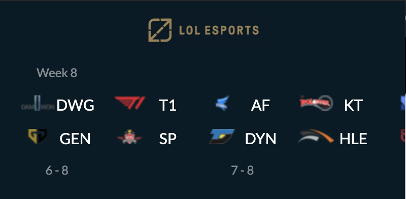

# LoL Esports Chrome Extension 

___

This chrome extension shows the next upcoming (and all previous) regular season LCK matches. 

Screenshots:

This is an unofficial extension that is not endorsed or affiliated by Riot Games Inc.

### How it works:

All the matches are scraped from the [LCK Gamepedia](https://lol.gamepedia.com/LCK/2020_Season/Summer_Season) in `scrape.py` using [BeautifulSoup](https://www.crummy.com/software/BeautifulSoup/bs4/doc/) and [Selenium](https://selenium-python.readthedocs.io/index.html). 

This is then converted to an array of `Match` objects in the `matches` array of popup.js. A bit of JavaScript and jQuery is then used to render this into the DOM of  `popup.html`. 

### Installation
This is an early proof of concept and needs a lot of polish. Currently, it is not published on the Chrome Extensions store. However, if you really **really** want it, you can load it as an unpacked extension in developer mode.

*I do not encourage this as developer mode is for, well, developing.*

### Contribution
Please feel free to *fork* this repository and submit a pull request to improve it!

#### TODO:
- Add other leagues and update when Worlds schedule is out

#### QOL:
- Change month numbers to months
- Create an API that the extension can access 